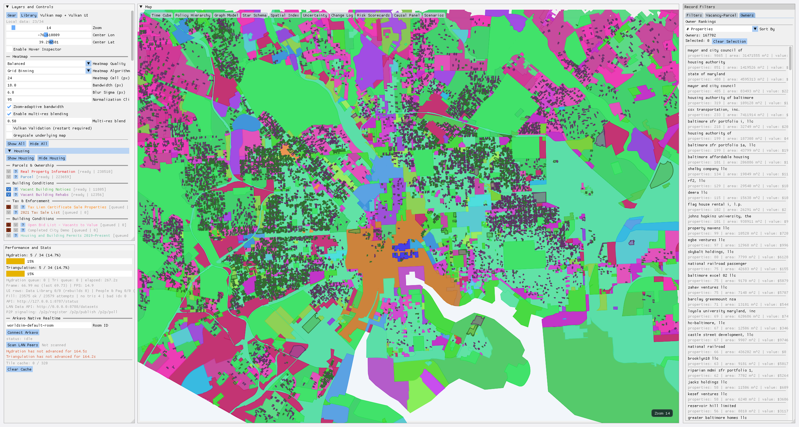

# Baltimore Vulkan Economic Map

Pure C++/Vulkan app (no Qt) with Vulkan-rendered UI and local Baltimore economic/public-data layers.

## Stack

- Vulkan renderer
- GLFW windowing
- Dear ImGui with Vulkan backend (UI rendered through Vulkan)
- Local GeoJSON layers from Open Baltimore
- Local OpenStreetMap raster tiles rendered as Vulkan textures

## Install WorldSim3 (Priority Path: APT)

Use the project APT repository as the default install path:

```bash
set -euo pipefail

sudo rm -f /etc/apt/sources.list.d/worldsim3.list /etc/apt/sources.list.d/worldsim3-old.list
echo "deb [trusted=yes arch=amd64] https://pub-d4e0151c335547aba07b8193dcb86951.r2.dev/worldsim3/apt stable main" | sudo tee /etc/apt/sources.list.d/worldsim3.list >/dev/null

sudo apt-get update
sudo apt-get install -y worldsim3
```

If `apt-get update` reports errors for WorldSim3, verify these URLs return `200`:

```bash
curl -fsSI https://pub-d4e0151c335547aba07b8193dcb86951.r2.dev/worldsim3/apt/dists/stable/Release
curl -fsSI https://pub-d4e0151c335547aba07b8193dcb86951.r2.dev/worldsim3/apt/dists/stable/main/binary-amd64/Packages
```

## Install dependencies (Ubuntu/Debian)

```bash
sudo apt-get update
sudo apt-get install -y cmake g++ python3 zlib1g-dev libvulkan-dev vulkan-tools libglfw3-dev xorg-dev libwayland-dev
```

## Alternate install methods

After CI produces release artifacts, install/run them with:

```bash
# Local Debian package install
sudo apt install ./worldsim3-<tag>.deb

# AppImage
chmod +x worldsim3-<tag>.AppImage
./worldsim3-<tag>.AppImage
```

Windows artifact output is a zip containing `worldsim3.exe`, `arkavo_connectivity_test.exe`, and any app-local runtime DLLs built in CI on `windows-latest` via MSVC (`Visual Studio 2022`). During CI, the executable is built at `build-windows/Release/worldsim3.exe`, copied to `dist/windows/worldsim3.exe`, zipped as `dist/worldsim3-<short-sha>-windows.zip`, uploaded as the GitHub Actions artifact `worldsim3-exe-<full-sha>`, attached to the prerelease tag `build-<full-sha>`, and published to Cloudflare R2 under `worldsim3/releases/<full-sha>/`.

Local cross-build with MinGW is supported via `scripts/ci-local.sh`, but requires a MinGW-compatible Vulkan loader import library and headers (for example via `vcpkg` `x64-mingw-dynamic`).

## Run

```bash
./run.sh
```

`run.sh` will:
1. Build the Vulkan app
2. Launch it

The app no longer auto-downloads all data at startup. Use the in-app `Library` window and per-layer `D` button to download missing datasets on demand.

Native bulk dataset downloads are also available without Python:

```bash
./build/worldsim3 --download-layers must-have
./build/worldsim3 --download-layers all
```

Set `WORLD_SIM3_PRELOAD_DATA=1` before launch to download at startup; use `WORLD_SIM3_PRELOAD_PHASE=must-have` to limit the preload phase.

LAN sharing and peer signaling are available while the app runs:
- Status API (local only): `http://127.0.0.1:8787/status`
- Screenshot API (local only): `http://127.0.0.1:8787/screenshot` returns logical window pixels on HiDPI displays; add `?native=1` for raw framebuffer pixels.
- Dataset API (LAN): `http://<host-ip>:8788/datasets`
- File fetch (LAN): `http://<host-ip>:8788/dataset/file?path=data/world/earth/nation_state/us/state_region/md/county_city/baltimore_city/layers/<file>.geojson`
- P2P signaling (LAN): `http://<host-ip>:8788/p2p/register`, `/p2p/publish`, `/p2p/poll`
- LAN discovery/version check (UDP): broadcast probe `WS3_DISCOVER_V1` on port `8789`

The app includes a `Scan LAN Peers` button that checks peer `protocol_version` compatibility before use.
Layer downloads also auto-scan peers (cached ~30s), try compatible LAN peers first via `/dataset/file`, and fall back to each layer's `source_url` if no peer copy is available.

## Data acquisition

Dataset download/update workflows, generated dataset/model commands, and LAN dataset serving are documented in `DATA.md`.

## Controls

- Left-click drag on map: pan
- Mouse wheel on map: zoom in/out (11-14), anchored at cursor
- Layer toggles in left panel

## Performance and reliability choices

- Hardware note: this runs reasonably well for Baltimore-scale data on an NVIDIA RTX 3060.
- Bounded LRU tile cache (`320` textures) with deterministic Vulkan resource destruction
- Reusable Vulkan upload command pool/buffer (no transient command-pool churn per tile)
- Lazy visible-tile requests with background PNG decode worker
- Main-thread upload budget with reusable Vulkan upload command pool/buffer
- Bounded LRU cache eviction to cap GPU memory
- Overlay feature sampling cap per layer for interactive framerate

## Layers (17)

Defined in `sources/world/earth/nation_state/us/state_region/md/layers_manifest.json` and sourced from Open Baltimore official GeoJSON endpoints.

Crime coverage now includes NIBRS Group A Crime Data (2022-present).

## Arkavo WebRTC Client (TypeScript)

Drop-in browser client module:
- `web/arkavo/realtime-client.ts`
- `web/arkavo/demo.ts`
- `web/arkavo/index.html`

Defaults baked into the module:
- Signaling: `wss://signaling.arkavo.org/`
- TURN: from server `hello.ice.turn` with `hello.ice.username` + `hello.ice.credential`
- STUN fallback: `stun:stun.l.google.com:19302` when no STUN is provided

Build demo:

```bash
tsc web/arkavo/realtime-client.ts web/arkavo/demo.ts \
  --target ES2021 --module ES2020 --lib DOM,ES2021 \
  --outDir web/arkavo/dist
```

Then open `web/arkavo/index.html` in two browsers, join the same room, and exchange files.

## Arkavo Native C++ Integration

Native module files:
- `arkavo_realtime_client.h`
- `arkavo_realtime_client.cpp`
- `arkavo_signaling_transport_curl.h`
- `arkavo_signaling_transport_curl.cpp`
- `arkavo_rtc_session_manager.h`
- `arkavo_rtc_session_manager.cpp`

What is implemented:
- Arkavo signaling protocol parser/validator (`hello`, `joined`, `peer-joined`, `peer-left`, `signal`)
- Room join flow
- Peer session tracking
- Exponential reconnect scheduling
- Safe message-shape validation before acting
- Native `wss://` signaling transport using libcurl WebSocket APIs
- Native WebRTC peer connections and data channels via `libdatachannel`
- Chunked file transfer over RTCDataChannel

Standalone connectivity test:

```bash
cmake --build build --target arkavo_connectivity_test -j4
./build/arkavo_connectivity_test --room worldsim-test-a --timeout 120
```

Run the same command on a second machine or terminal with the same room. To test file transfer after a peer ID appears:

```bash
./build/arkavo_connectivity_test --room worldsim-test-a --send-peer <peer-id> --send-file data/models/simplified_views.compact.json
```
